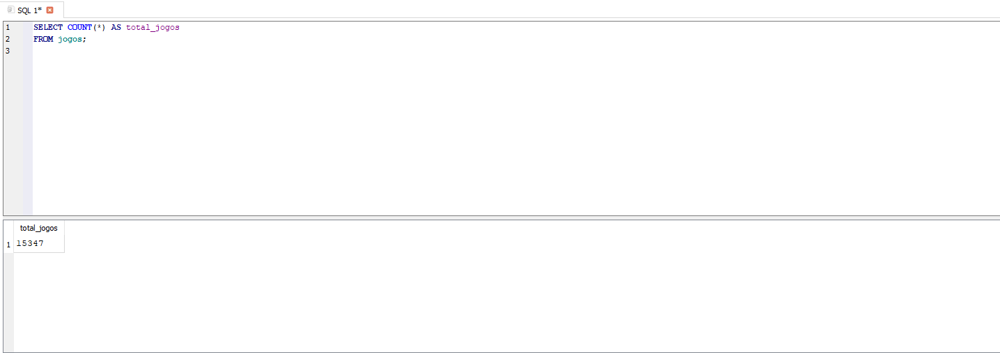
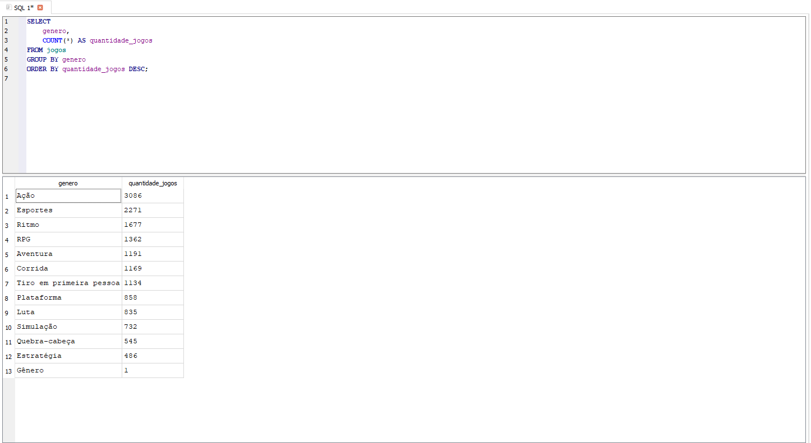
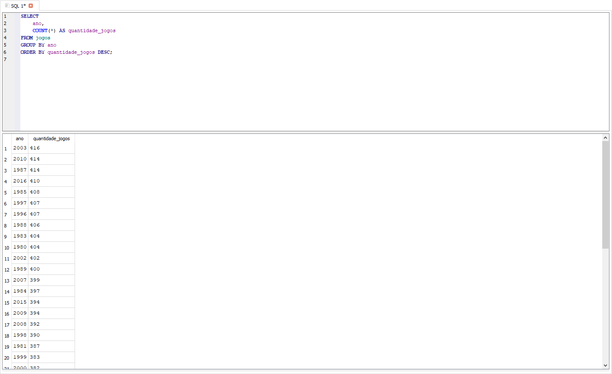
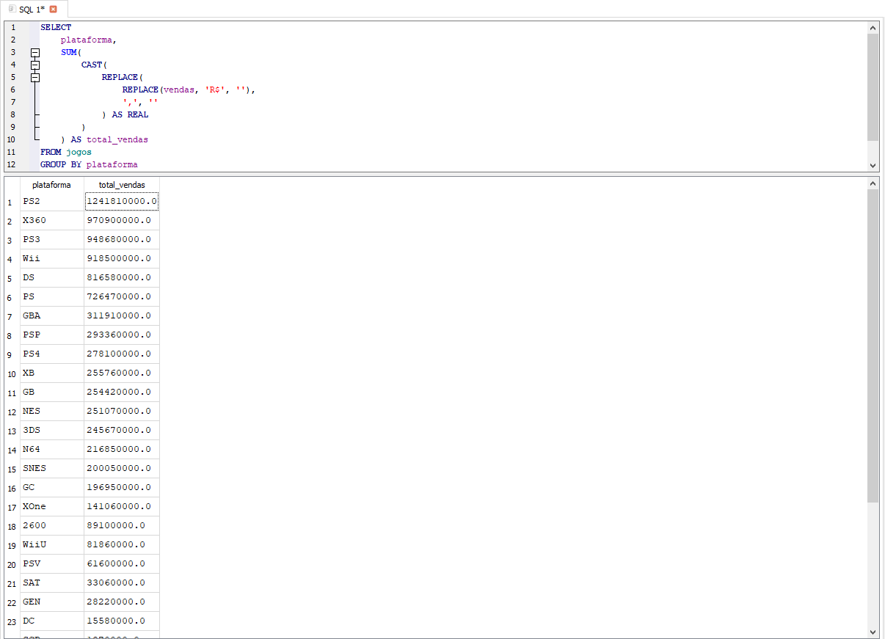

# 🎮 Análise de Vendas de Jogos com SQL

Projeto de análise de dados utilizando **SQL (SQLite)** com foco em exploração de dados, agregações e geração de insights a partir de uma base de vendas de jogos.

---

## 📌 Objetivo do Projeto

Explorar uma base de dados de jogos para responder perguntas de negócio como:

- Quantos jogos existem na base?
- Quais gêneros possuem mais títulos?
- Em quais anos foram lançados mais jogos?
- Quais plataformas geraram maior volume de vendas?

---

## 🗂️ Base de Dados

- Banco de dados: **SQLite**
- Arquivo: `jogos.db`
- Total de registros analisados: **15.347 jogos**
- Dados utilizados exclusivamente para fins educacionais

---

## 🛠️ Ferramentas Utilizadas

- SQL (SQLite)
- DB Browser for SQLite
- Git & GitHub

---

## 📊 Análises Realizadas

### 🔢 Total de Jogos
Consulta para identificar o total de jogos na base.

---

### 🎯 Jogos por Gênero
Identificação dos gêneros com maior quantidade de títulos.

- Destaque: **Ação** com **3.086 jogos**

---

### 📆 Jogos por Ano
Análise dos anos com maior volume de lançamentos.

- Destaque: **2003** com **416 jogos**

---

### 🕹️ Vendas por Plataforma
Soma do valor de vendas por plataforma.

- Destaque: **PS2** como a plataforma com maior faturamento

---

## 💡 Principais Insights

- O gênero **Ação** domina a base em número de títulos.
- O ano de **2003** foi o mais produtivo em lançamentos.
- Plataformas clássicas como **PS2, Xbox 360 e PS3** concentram a maior parte das vendas.
- O mercado apresenta forte concentração de vendas em plataformas líderes.

---

## 📁 Estrutura do Projeto

projeto-sql-jogos/
├── database/
├── sql/
├── images/
└── README.md

---

## 👨‍💻 Autor

**Pedro Ajala**  
Analista de Dados  
📎 GitHub: https://github.com/AjalaAnalytics  
🔗 LinkedIn: https://www.linkedin.com/in/pedroajala01/
